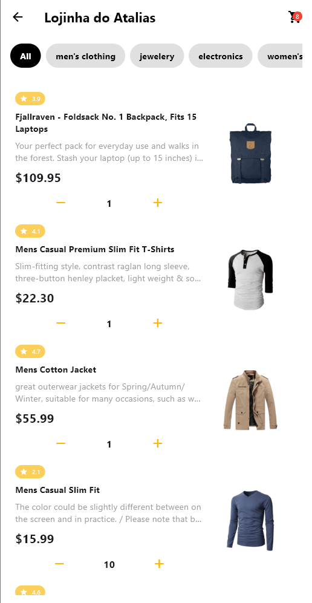
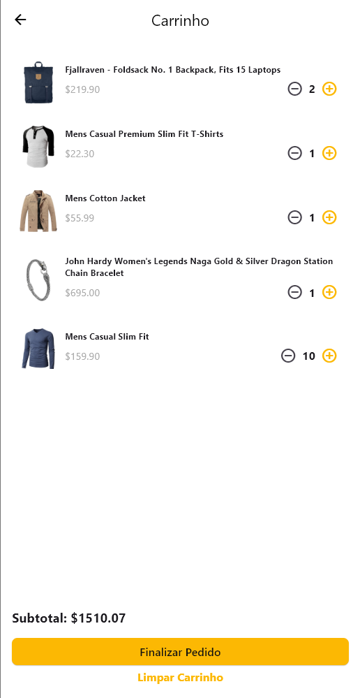

# Flutter Shopping Cart MVVM 🛒

Um aplicativo Flutter de carrinho de compras desenvolvido seguindo o padrão arquitetural MVVM (Model-View-ViewModel), demonstrando boas práticas de desenvolvimento mobile com injeção de dependências, gerenciamento de estado reativo e testes unitários.

## 📱 Funcionalidades

- **Catálogo de Produtos**: Navegue por diferentes categorias de produtos
- **Carrinho de Compras**: Adicione, remova e ajuste quantidades de produtos
- **Gestão de Estado**: Interface reativa com atualizações em tempo real
- **Checkout**: Processo completo de finalização de pedidos
- **Tratamento de Erros**: Feedback visual para operações de rede
- **Arquitetura MVVM**: Separação clara de responsabilidades
- **Injeção de Dependências**: Usando GetIt para gerenciamento de dependências
- **Testes Unitários**: Cobertura de testes para ViewModels

## 🏗️ Arquitetura

O projeto segue o padrão **MVVM (Model-View-ViewModel)** com:

```
lib/
├── modules/                    # Módulos da aplicação
│   ├── home/                  # Tela inicial e catálogo
│   ├── cart/                  # Carrinho de compras  
│   └── order_completed/       # Confirmação de pedido
├── shared/                    # Código compartilhado
│   ├── entities/              # Modelos de dados
│   ├── services/              # Serviços de negócio
│   ├── infrastructure/        # APIs e comunicação
│   ├── di/                    # Injeção de dependências
│   ├── navigation/            # Rotas da aplicação
│   ├── theme/                 # Temas e estilização
│   ├── utils/                 # Utilitários (formatters)
│   └── widgets/               # Widgets reutilizáveis
```

## 📋 Requisitos

### Versões Necessárias
- **Flutter**: `>=3.38.5` (channel stable)
- **Dart**: `^3.10.4`
- **SDK mínimo**: API 21+ (Android) / iOS 11+

### Dependências Principais
- `dio: ^5.9.0` - Cliente HTTP para comunicação com APIs
- `get_it: ^9.2.0` - Injeção de dependências
- `flutter_dotenv: ^5.1.0` - Gerenciamento de variáveis de ambiente

### Dependências de Desenvolvimento
- `flutter_test` - Framework de testes
- `flutter_lints: ^6.0.0` - Regras de linting

## 🚀 Instruções de Build/Run

### Recomendo rodar em windows, já que é mais direto ao ponto e não passa por compilação android.

### 1. Pré-requisitos
Certifique-se de ter o Flutter instalado:
```bash
flutter doctor
```

### 2. Clonar o Repositório
```bash
git clone <url-do-repositório>
cd flutter_shopping_cart_mvvm
```

### 3. Instalar Dependências
```bash
flutter pub get
```

### 4. Configuração de Ambiente
Crie um arquivo `.env` na raiz do projeto:
```env
API_BASE_URL=https://fakestoreapi.com
```

### 5. Executar em Desenvolvimento
```bash
# Android
flutter run

# iOS  
flutter run -d ios

# Web
flutter run -d chrome

# Windows
flutter run -d windows
```

### 6. Build para Produção (não está implementado --release para android)
```bash
# Android APK
flutter build apk --release

# Android Bundle
flutter build appbundle --release

# iOS
flutter build ios --release

# Web
flutter build web --release

# Windows
flutter build windows --release
```

### Análise de Código
```bash
# Análise estática
flutter analyze

# Formatação de código
flutter format .
```

## 📱 Fluxo da Aplicação

1. **Tela Inicial (Home)**: Exibe catálogo de produtos com filtros por categoria
2. **Adicionar ao Carrinho**: Produtos podem ser adicionados/removidos do carrinho
3. **Tela do Carrinho**: Visualização e gestão de itens no carrinho
4. **Checkout**: Processamento do pedido com validações
5. **Confirmação**: Tela de sucesso com detalhes do pedido

## 🎯 Destaques Técnicos

- **Padrão MVVM**: Separação clara entre UI e lógica de negócio
- **Reactive UI**: Interface atualiza automaticamente com mudanças de estado
- **Dependency Injection**: GetIt para gerenciamento de dependências
- **Error Handling**: Tratamento robusto de erros de API
- **State Management**: ChangeNotifier para gestão de estado
- **Clean Architecture**: Organização modular e testável
- **Mock APIs**: Simulação de APIs para desenvolvimento e testes

## 📦 Estrutura de Dados

### Modelos Principais
- `Product` - Representa um produto do catálogo
- `CartItem` - Item no carrinho com produto e quantidade  
- `CartResponseModel` - Resposta das operações de carrinho
- `CheckoutResponseModel` - Resposta do processo de checkout

### Serviços
- `ProductApi` - Comunicação com API de produtos
- `CartApi` - Operações de carrinho no servidor
- `CheckoutApi` - Processamento de pedidos
- `CartService` - Lógica de negócio do carrinho

## 🔧 Configuração de Desenvolvimento

### VS Code (Recomendado)
Instale as extensões:
- Flutter
- Dart

### Android Studio
- Configure o Flutter SDK
- Instale os plugins Flutter e Dart

### Imagens




**Desenvolvido com ❤️ por Atalias Raniel**
